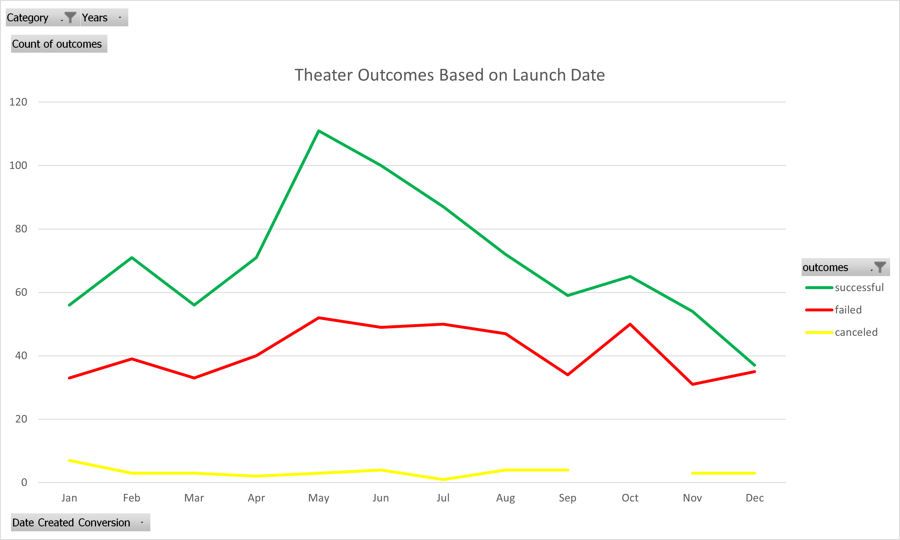
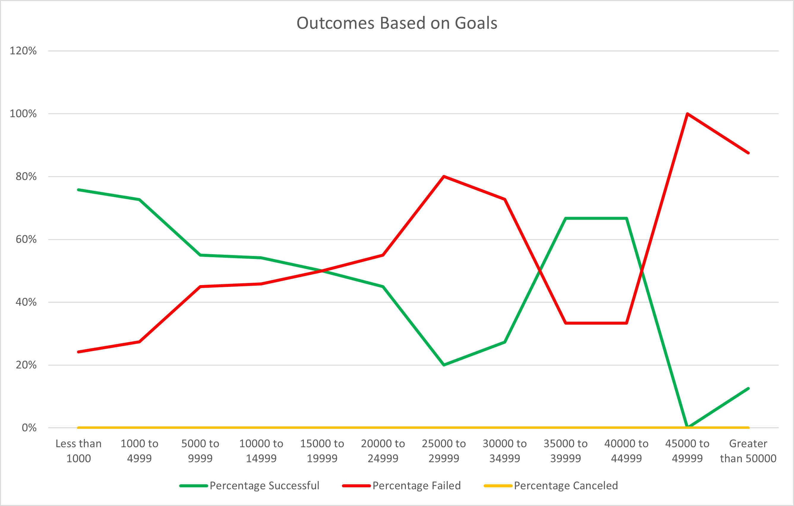

# Kickstarting with Excel

## Overview of Project
### Purpose
The purpose of this analysis is to reveal trends in crowdfunding for theater projects with respect to funding campaign launch date and goals.  This analysis uses data from the popular Kickstarter crowdfunding platform.  Revealing trends that influence the success or failure of a campaign can offer useful insight that can be used to plan a successful campaign.

## Analysis and Challenges

For reference, the Excel worksheet used for the analyses described below can be found [here](Kickstarter_Challenge.xls).

### Analysis of Outcomes Based on Launch Date

The analysis for outcomes based on launch date was performed by first aggregating the Kickstarter data such that it is organized by outcome and month of the year.  The Kickstarter data covers several years, aggregating the data by month of year is critical to determining if there are common yearly or seasonal patterns.  This aggregation was generated using an Excel Pivot Table.  Once the data was aggregated it was easy to visualize using a line graph that plots the number of each outcome type (successful, failed, and canceled) by month of year.  The result is shown below.

<figure>

<figcaption align = "center"><b>Figure 1 - Plot of Kickstarter Outcomes vs. Month of Year for Theater Projects</b></figcaption>
</figure>

### Analysis of Outcomes Based on Goals
A similar process was followed to visualize outcomes based on funding goals.  The Kickstarter data was aggregated by using Excel to count every instance of a goal range.  As an example, the funding goals for successful projects that fell into the range 5000-9999 (all currencies) uses the following formula:
```
=COUNTIFS(Kickstarter!D:D, ">=5000", Kickstarter!D:D, "<10000", Kickstarter!F:F, "=successful", Kickstarter!R:R, "=plays")
```
Where column D of the Kickstarter sheet is the funding goal, column F is the outcome, and column R is the sub-category.  Once the data was aggregated the percent successful, failed, and canceled was calculated, resulting in a table of outcomes (pct) for each funding goal range.  This table is plotted in the line graph below.

<figure>

<figcaption align = "center"><b>Figure 1 - Plot of Kickstarter Outcomes vs. Goals for Theater Plays</b></figcaption>
</figure>

### Challenges and Difficulties Encountered
A key challenge when working with Excel is formula readability.  Long formulas on a single line of text can be difficult to read and troubleshoot if a mistake is made when entering that formula. To manage this I often build up the formulas incrementally and confirm that they are doing what I expect with every increment.

## Results

- What are two conclusions you can draw about the Outcomes based on Launch Date?

    The first conclusion we can draw from the outcomes based on launch data analysis is that many more campaigns are launched in the spring than any other time of the year, and those campaigns are largely successful.  In particular, May is a very popular launch date.  

    In the opposite, Q3 of the calendar year is both unpopular and and larger percentage of the campaigns end in failure or cancellation.

- What can you conclude about the Outcomes based on Goals?

    The largest number of successful campaigns are in the $0-5000 range.  There is a clear drop after $5000 and failures begin to exceed successes after $15,000.

- What are some limitations of this dataset?

    A key limitation of the data is the lack of a qualitative measurement of a given campaign's overall appeal to the Kickstarter community.  Such a measurement would allow us to isolate unpopular campaigns and better understand how other variables affect the success of the campaign.

    Also, there is no geographic or demographic data for the campaigns or their backers.  This data would help us provide a more accurate forecast based on the locale that would benefit from the results of the campaign.  This would be particularly useful for theater campaigns since certain locales and populations value theater more than others.

- What are some other possible tables and/or graphs that we could create?

    With the data provided we could plot the percentage funded by month to enhance our understanding of the outcomes by month data.  If outcomes are both more likely to be successful and more successful in terms of funding when launched in Q2 of the calendar year strengthen the argument that Q2 is a good time to launch a campaign.  

    Another interesting analysis might be outcome vs. campaign duration and pledges vs. campaign duration.  Are longer campaigns more likely to be successful?

    The data also allows us to compute the average donation per backer.  We can plot this against outcomes, time of year, and goal to see if any of those variables influence the average donation.  
